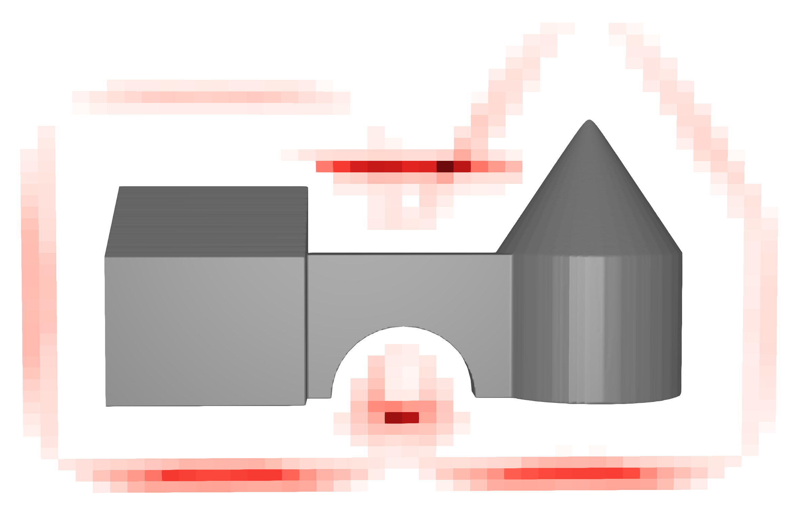

# AdaptivePotentialField.jl

Source code for the publication "Potential-Guided UAV-Flight Path Planning
for the Inspection of Complex Structures" by Paul Debus and Prof. Volker Rodehorst at the ISPRS Geospatial Week 2023.

## Summary
The code in this package provides functionality to compute the potential a viewpoint position would provide to a viewpoint arrangement or UAV flight path. A viewpoint is defined in 5D space by a position and two polar coordinates for the viewing direction.

The potential is based on the improved coverage of the structure of interest by a viewpoint. It is computed as the sum of the observation quality of a set of surface points, weighted by their reconstruction uncertainty. For a more detailed explanation please consult the publication or study the source code.

## Abstract of the Paper
This works presents a method to compute a potential field for UAV flight path planning for the image-based inspection of complex
structures. The potential field is based on the photogrammetric requirements of the inspection and allows to estimate the potential of
a viewpoint position to improve the coverage and reconstructability of the structure, based on a model of the structure and the pre-
vious viewpoints. This potential field can be used to guide the planning of the flight path to produce globally optimized flight paths,
that minimize the number of required images and the length of the flight path, while achieving complete coverage, high resolution
and stable reconstructability. The estimation of the potential is implemented efficiently and continuously differentiable to allow for
the use in optimization algorithms. In addition, a general framework for potential-based flight path planning is presented that allows
to integrate different requirements and constraints into the planning process, outlining the requirements for the implementation of a
flight path planning method using this framework. The method is evaluated and validated in a synthetic realistic scenario, where it
demonstrated high performance and reliable results. It is able to identify regions of high potential even in complex environments,
for example the underside of an overpass of tight corners that often pose challenges for existing methods.

## Example
For two examples consider the `planning` folder. 

## License
The code is provided under the GPL-3.0 license. For more information please consult the LICENSE file.

## Contributing and Support
For questions, suggestions or bug reports, please contact [Paul Debus](mailto:paul.debus@uni-weimar.de?subject=AdaptivePotentialField.jl) via email.
